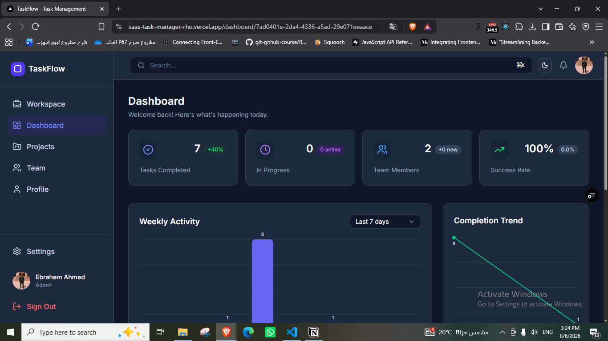
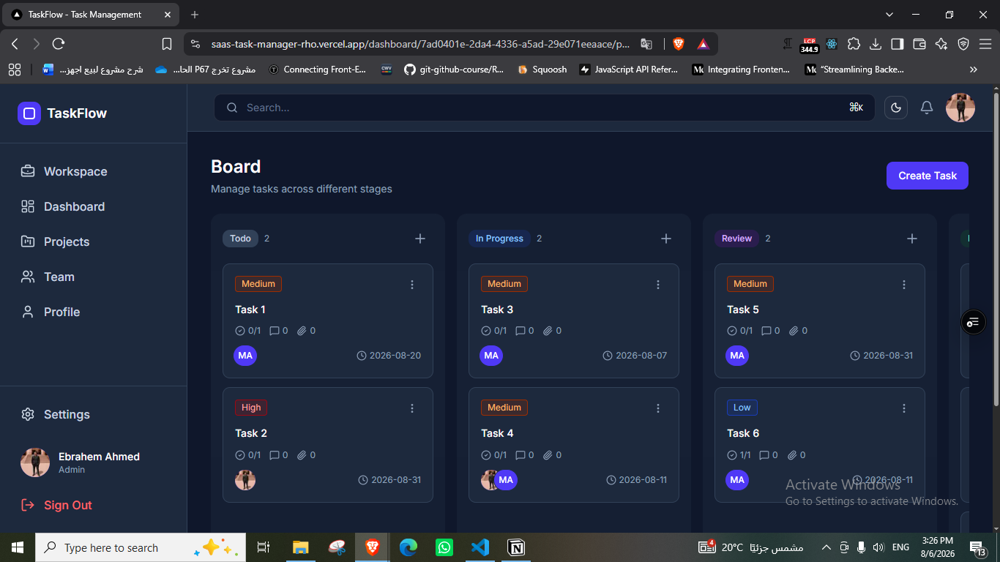
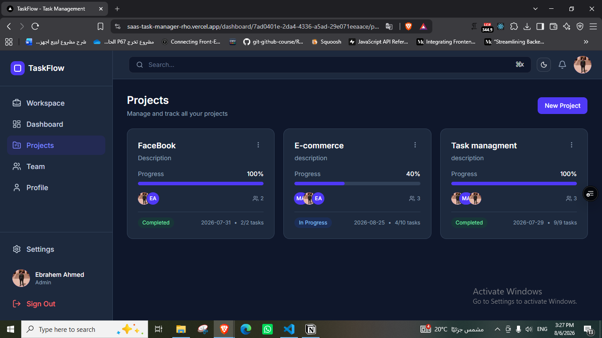

# TaskFlow


A modern, workspace-based task management SaaS — kanban boards, projects, teams, dashboards, notifications, and global search — all wrapped in a polished, accessible UI and backed by Supabase.

## Screenshots





## About the Developer

I'm a **strong junior frontend developer** focused on clean, responsive, accessible UIs with **Next.js, React, and TypeScript**, with solid practical experience integrating **Supabase and PostgreSQL** (auth, storage, realtime, data modeling, RLS, SQL functions/RPC, triggers).

TaskFlow is the product: a frontend-driven app backed by Supabase with no custom API layer — data goes straight from the client to the database through typed queries and RPC calls.

## Core Features

- **Drag-and-drop kanban board** — columns for To-do, In Progress, Review, and Done, built with dnd-kit
- **Optimistic UI** — instant, snappy interactions via TanStack Query cache updates
- **Global search** — ⌘K / Ctrl-K command palette searching across workspaces, projects, tasks, and people via a single RPC function
- **Rich text task descriptions** — TipTap editor with @mentions and formatted content
- **Role-aware UI** — Admin / Manager / Member permissions gate dashboards, actions, and member management across the app
- **Dashboards with charts** — Recharts visualizations and stat cards with range filters
- **Team & permissions** — workspaces, invitations, member roles, and skill tags
- **Notifications & activity** — per-user notification feed and audit-style activity history
- **Profiles & avatars** — user profiles with avatar uploads to Supabase Storage
- **Theming** — full dark/light mode via next-themes
- **Responsive & accessible** — sidebar-to-drawer transitions on mobile, keyboard-friendly, ARIA-aware, skip links, and strong focus states

## Frontend Stack & Architecture

This is where the bulk of the effort lives.

- **Next.js (App Router)** with Server Components, route groups, and metadata/SEO
- **React 19 + TypeScript**
- **Tailwind CSS v4** for styling
- **shadcn/ui + Radix UI** for accessible primitives
- **TanStack Query** — server-side prefetching with hydration for fast initial loads, plus optimistic updates and cache invalidation
- **dnd-kit** for the kanban drag-and-drop experience
- **TipTap** for the rich text editor
- **Recharts** for dashboard visualizations
- **zod** for form validation and typed data contracts
- **sonner** for toasts, **next-themes** for theming
- **date-fns** for date handling

The codebase is organized into **feature folders** (`features/kanban`, `features/projects`, `features/team`, etc.) with shared components, hooks, and services. Context providers manage current-user and project/team state, while React Query owns server state. Loading skeletons, empty states, and error handling are implemented consistently across every view.

## Backend Integration via Supabase

I don't write a custom backend — I use **Supabase as the backend** and integrate it properly. TaskFlow exercises a broad slice of the platform, and the data layer is deliberately RPC-first.

### Authentication

- Email/password signup, login, logout, and session management
- Route protection via a middleware/proxy layer that refreshes sessions and redirects unauthenticated users
- Password change with current-password re-verification and email change with confirmation

### PostgreSQL Data Modeling

Tables designed with clear relationships:

- **`profiles`** — 1:1 with `auth.users`
- **`workspaces`** ↔ **`profiles`** — many-to-many via `workspace_members` with a `role` (admin / manager / member)
- **`projects`** ↔ **`profiles`** — many-to-many via `project_assignments`
- **`tasks`** ↔ **`profiles`** — many-to-many via `task_assignments`
- **`tasks`** → **`subtasks`**, **`comments`**, **`mentions`**, **`activity_log`** — one-to-many
- **`notifications`**, **`workspace_invitations`**, **`skills`** — supporting entities

### Security: RLS + RPC

Workspace-scoped access control is enforced in the database, not just in the UI. The read paths go through **SECURITY DEFINER-style SQL functions (RPC)** that validate the session and workspace membership server-side, with **row-level security policies** configured in the Supabase project. The UI layers role-based behavior on top.

The SQL functions the app actually calls include:

- `get_workspaces_data`
- `get_projects_data`
- `get_tasks_data`
- `get_team_data`
- `get_dashboard_data`
- `get_current_workspace_user`
- `get_current_user_settings`
- `get_profile_data`
- `get_project_members`
- `get_user_projects_with_progress`
- `create_notification_if_not_member`
- `global_search`

### Realtime

- `postgres_changes` subscriptions keep the kanban board in sync per project
- Per-user notification subscriptions deliver live updates

### Storage

- Avatar uploads, deletion, and public URLs from the storage bucket, stored per-user

### Database Triggers

- Configured in the Supabase project — a trigger creates a `profiles` row automatically on signup (the app's signup flow only calls `supabase.auth.signUp()` and relies on the database for the rest), so the frontend can depend on a consistent user record right after registration.

## Project Structure

```
├── app/
│   ├── (auth)/              # Login / Signup / Forgot & reset password
│   └── (root)/              # Dashboard, kanban, projects, team, profile
│   ├── providers/           # React Query, theme, toast providers
│   └── ...
├── components/              # Shared UI primitives (shadcn/ui)
├── context/                 # Current user / project / team context
├── features/                # Feature-scoped components, hooks, services
├── lib/
│   ├── supabase/            # Browser client, SSR client, session proxy
│   └── utils/               # Helpers (cn, formatting)
├── proxy.ts                 # Session refresh + route protection
└── next.config.ts
```

## Getting Started

```bash
npm install
npm run dev
```

Create a `.env` file with your Supabase project credentials:

```
NEXT_PUBLIC_SUPABASE_URL=your_project_url
NEXT_PUBLIC_SUPABASE_PUBLISHABLE_KEY=your_publishable_key
```

> The database schema, RLS policies, SQL functions, and triggers live in the Supabase project — this repository contains the application code that consumes them through the Supabase client.
